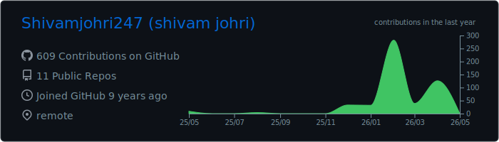
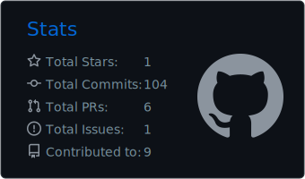
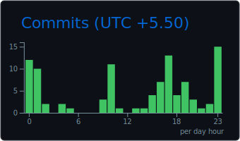

# Shivam Johri

**Principal AI Engineer** | 10+ Years experience

---

### About Me

<table>
<tr>
<td width="50%" valign="top">

**Current Focus**
- Architecting autonomous AI agents & production RAG systems
- Building scalable LLM inference pipelines
- Implementing Responsible AI guardrails

**Role & Experience**
- Principal AI Engineer @ Suzega
- 10+ years in AI/ML Engineering
- Location: India (Remote)

</td>
<td width="50%" valign="top">

**Key Expertise Areas**

**LLMs & Fine-tuning**
PEFT/LoRA, Prompt Engineering, Model Guardrails

**Agentic AI**
LangChain, LangGraph, Semantic Kernel, Voice Agents

**MLOps**
Real-time Inference, Latency Optimization, Model Observability

**NLP**
NER, Semantic Search, Embeddings, RAG Pipelines

</td>
</tr>
</table>

---

### Core Expertise

**LLMs & Generative AI**

**ML Frameworks**

**Vector Databases & Search**

**Cloud & MLOps**

**Programming**

---

### Featured Projects

<table>
<tr>
<td width="50%">

**[llm-finetuning](https://github.com/Shivamjohri247/llm-finetuning)**

Reusable pipeline for fine-tuning SLMs on downstream tasks using PEFT/LoRA for efficient resource usage and faster inference.

`Python` `PyTorch` `PEFT` `LoRA`

</td>
<td width="50%">

**[GenNER](https://github.com/Shivamjohri247/GenNER)**

Named Entity Recognition using Generative AI approaches with Transformer models.

`NER` `Transformers` `HuggingFace`

</td>
</tr>
<tr>
<td width="50%">

**[med-text-classify](https://github.com/Shivamjohri247/med-text-classify)**

Medical text classification using NLP techniques for healthcare domain applications.

`Jupyter` `NLP` `Healthcare`

</td>
<td width="50%">

**[Emotion Classifier](https://github.com/Shivamjohri247)**

Open-source NLP project for sequence classification and model evaluation using HuggingFace Transformers.

`NLP` `Classification` `HuggingFace`

</td>
</tr>
</table>

---

### Experience Highlights

| Company | Role | Focus Areas |
|---------|------|-------------|
| **Suzega** | Principal AI Engineer | Agentic AI, LangGraph, Voice Agents, RAG Systems |
| **EPAM Systems** | Senior ML Engineer | NER Fine-tuning, LLM Query Optimization, Semantic Search |
| **Accenture** | ML Engineering Senior Analyst | GenAI at Scale, Cloud AI Pipelines, Computer Vision |
| **TCS** | Machine Learning Engineer | ETL Pipelines, Feature Engineering, Data Processing |

---

### Certifications

---

### GitHub Activity

  

  
  
  

---

**Open to collaborating on AI/ML projects and discussing production-scale LLM systems**

