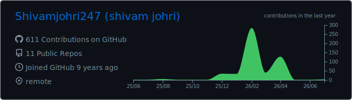
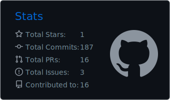
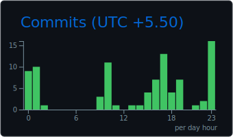
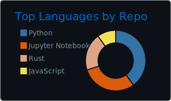

# Shivam Johri

**AI Architect | Applied AI Lead & Agentic Systems | Multi-Agent Orchestration | Enterprise AI**

---

### About Me

<table>
<tr>
<td width="50%" valign="top">

**Current Focus**
- Designing production-grade Agentic AI & multi-agent systems for enterprise clients
- Building autonomous agent workflows across Manufacturing & Financial Services
- Driving applied R&D in agent accuracy, autonomy, scaling & efficiency
- Implementing enterprise AI guardrails & Responsible AI governance

**Role & Experience**
- AI Architect, Applied R&D & Industry Solutions @ Suzega
- 10+ years in AI/ML Engineering
- ex-EPAM | ex-Accenture | ex-TCS
- Location: India (Remote)

</td>
<td width="50%" valign="top">

**Key Expertise Areas**

**Multi-Agent Systems & Agentic AI**
LangGraph, CrewAI, OpenAI Agents SDK, AWS Strands Agents, AutoGen

**LLMs & Fine-tuning**
PEFT/LoRA, Prompt Engineering, Model Guardrails, Agentic RAG

**Agent Protocols & Interoperability**
MCP, ACP, A2A

**NLP & Search**
NER, Semantic Search, Embeddings, RAG Pipelines

**MLOps**
Real-time Inference, Latency Optimization, Model Observability

</td>
</tr>
</table>

---

### Core Expertise

**Agentic AI & Multi-Agent Systems**

**LLMs & Generative AI**

**ML Frameworks**

**Vector Databases & Search**

**Cloud & MLOps**

**Programming**

---

### Featured Projects

<table>
<tr>
<td colspan="2">

**[diff-guard](https://github.com/Shivamjohri247/diff-guard)** &nbsp; 

Blast radius analyzer for AI-generated code changes. Detects unintended modifications by AI coding agents, measures downstream impact via import-chain analysis, and blocks dangerous commits before they reach production. Works as a git pre-commit hook with integrations for Claude Code, Cursor, Windsurf, and any AI agent. Supports Python (AST), JS/TS, Go, Rust, Java, and more.

`Python` `CLI` `AST Analysis` `Git Hooks` `AI Safety` `PyPI`

</td>
</tr>
<tr>
<td width="50%">

**[llm-finetuning](https://github.com/Shivamjohri247/llm-finetuning)**

Reusable pipeline for fine-tuning SLMs on downstream tasks using PEFT/LoRA for efficient resource usage and faster inference.

`Python` `PyTorch` `PEFT` `LoRA`

</td>
<td width="50%">

**[GenNER](https://github.com/Shivamjohri247/GenNER)**

Named Entity Recognition using Generative AI approaches with Transformer models.

`NER` `Transformers` `HuggingFace`

</td>
</tr>
<tr>
<td width="50%">

**[med-text-classify](https://github.com/Shivamjohri247/med-text-classify)**

Medical text classification using NLP techniques for healthcare domain applications.

`Jupyter` `NLP` `Healthcare`

</td>
<td width="50%">

**[Emotion Classifier](https://github.com/Shivamjohri247/emotion-classifier)**

NLP project for emotion detection in text using sequence classification and HuggingFace Transformers.

`NLP` `Classification` `HuggingFace`

</td>
</tr>
</table>

---

### Experience Highlights

| Company | Role | Focus Areas |
|---------|------|-------------|
| **Suzega** | AI Architect, Applied R&D & Industry Solutions | Multi-Agent Orchestration, Agentic AI, Manufacturing & Financial Services, Responsible AI |
| **EPAM Systems** | Senior Data Scientist | NER Fine-tuning, LLM Query Optimization, Semantic Search, Vector Embeddings |
| **Accenture** | ML Engineering Senior Analyst | GenAI Accelerators, Recommendation Engines, Computer Vision, Document Intelligence |
| **TCS** | Machine Learning Engineer | Computer Vision, NLP, OCR, Document Intelligence, BFSI R&D |

---

### Certifications

---

### GitHub Activity

  

  
  
  

---

**Open to collaborating on Agentic AI, multi-agent systems & production-scale LLM projects**

