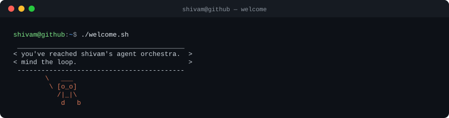
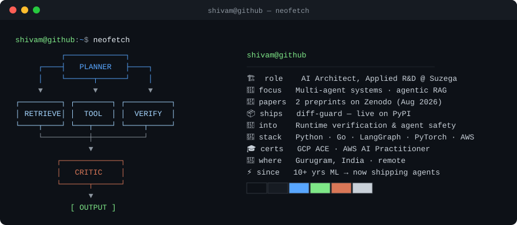
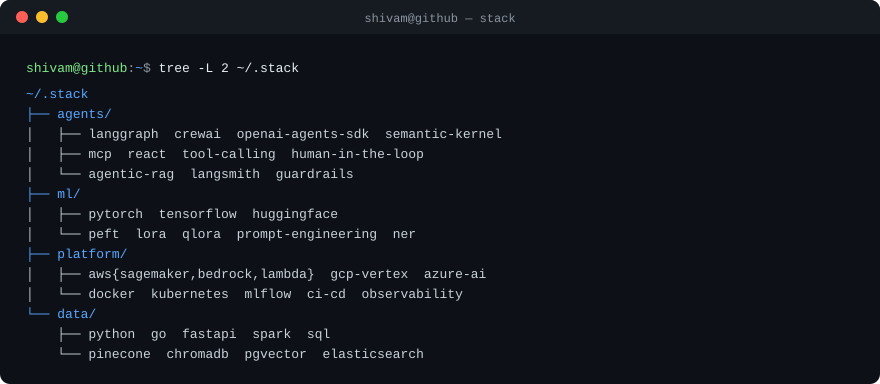
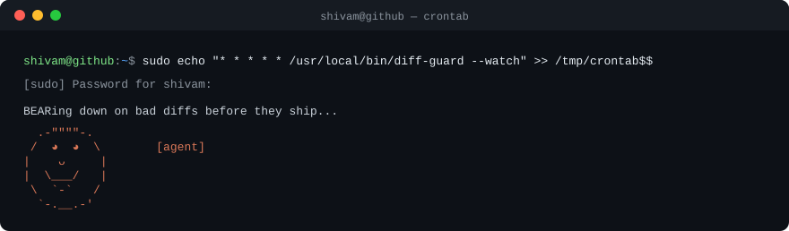

<!--
  Terminal-style profile README.
  Panes in assets/ are generated by tools/gen_assets.py — edit that, not the SVGs.
  Layout inspired by github.com/TryKatChup
-->

<picture>
  <source media="(prefers-color-scheme: dark)"  srcset="assets/banner.svg">
  <source media="(prefers-color-scheme: light)" srcset="assets/banner-light.svg">
  
</picture>

<picture>
  <source media="(prefers-color-scheme: dark)"  srcset="assets/neofetch.svg">
  <source media="(prefers-color-scheme: light)" srcset="assets/neofetch-light.svg">
  
</picture>

---

### 📄 Research

```console
shivam@github:~$ cat research/*.txt
```

```
[1] Self-Verifying Scene-Graph Memory for
    Long-Horizon Embodied Task Execution
    ──────────────────────────────────────────────────────
    Structured, object-centric scene-graph memory paired with
    per-step self-verification for partially-observable,
    stochastic long-horizon tasks.

      → success 0.15 → 0.60 on kitchen benchmark
      → near-total recovery from execution failures
      → open-weight LLMs · no GPU, no robot, no training data

    doi:10.5281/zenodo.21965132        preprint · CC-BY-4.0

[2] Dynamic Skill Safety Filters via Differential
    Failure Attribution for Autonomous Robot Agents
    ──────────────────────────────────────────────────────
    Online, context-conditioned estimate of per-skill failure
    propensity — disables risky skills only in hazardous
    contexts, rather than blanket-blocking them.

      → 0 safety violations at 100% task success
      → beats static blocklists that sacrifice functionality
      → lightweight runtime layer, no extra hardware or data

    doi:10.5281/zenodo.21965130        preprint · CC-BY-4.0
```

📄 &nbsp;[10.5281/zenodo.21965132](https://doi.org/10.5281/zenodo.21965132) &nbsp;·&nbsp; [10.5281/zenodo.21965130](https://doi.org/10.5281/zenodo.21965130)

---

### 🚀 Projects

```console
shivam@github:~$ ls -la ~/projects/
```

```
total 2
drwxr-xr-x   diff-guard/        python    ★ pypi:diffguard-cli
                 blast-radius analyzer for AI-generated code
                 6-stage static analysis · py/js/ts/go/rust/java
                 pre-commit gate for Claude Code, Cursor, Windsurf

drwxr-xr-x   llm-finetuning/    python    peft · lora · qlora
                 modular fine-tuning pipeline — 4-bit quant,
                 gradient checkpointing, multi-GPU
                 fine-tuning setup: days → hours
```

🔗 &nbsp;[diff-guard](https://github.com/Shivamjohri247/diff-guard) &nbsp;·&nbsp; [llm-finetuning](https://github.com/Shivamjohri247/llm-finetuning) &nbsp;·&nbsp; [](https://pypi.org/project/diffguard-cli/)

---

<picture>
  <source media="(prefers-color-scheme: dark)"  srcset="assets/gitlog.svg">
  <source media="(prefers-color-scheme: light)" srcset="assets/gitlog-light.svg">
  
</picture>

<picture>
  <source media="(prefers-color-scheme: dark)"  srcset="assets/stack.svg">
  <source media="(prefers-color-scheme: light)" srcset="assets/stack-light.svg">
  
</picture>

---

### 🎓 Certifications

```
[✓] Google Cloud — Associate Cloud Engineer
[✓] AWS — Certified AI Practitioner
[✓] DeepLearning.AI — Advanced Generative AI & LLMs
```

### 🤝 Connect

```
 ___________________________________________
< open to: agentic AI · multi-agent systems  >
< · production-scale LLM work.               >
 -------------------------------------------
```

🔗 &nbsp;[LinkedIn](https://linkedin.com/in/shivam-johri) &nbsp;·&nbsp; [Email](mailto:shivamjohri247@gmail.com) &nbsp;·&nbsp; [Twitter](https://twitter.com/sicdrummer247) &nbsp;·&nbsp; [Zenodo](https://zenodo.org/search?q=Shivam%20Johri)

---

<picture>
  <source media="(prefers-color-scheme: dark)"  srcset="assets/footer.svg">
  <source media="(prefers-color-scheme: light)" srcset="assets/footer-light.svg">
  
</picture>
